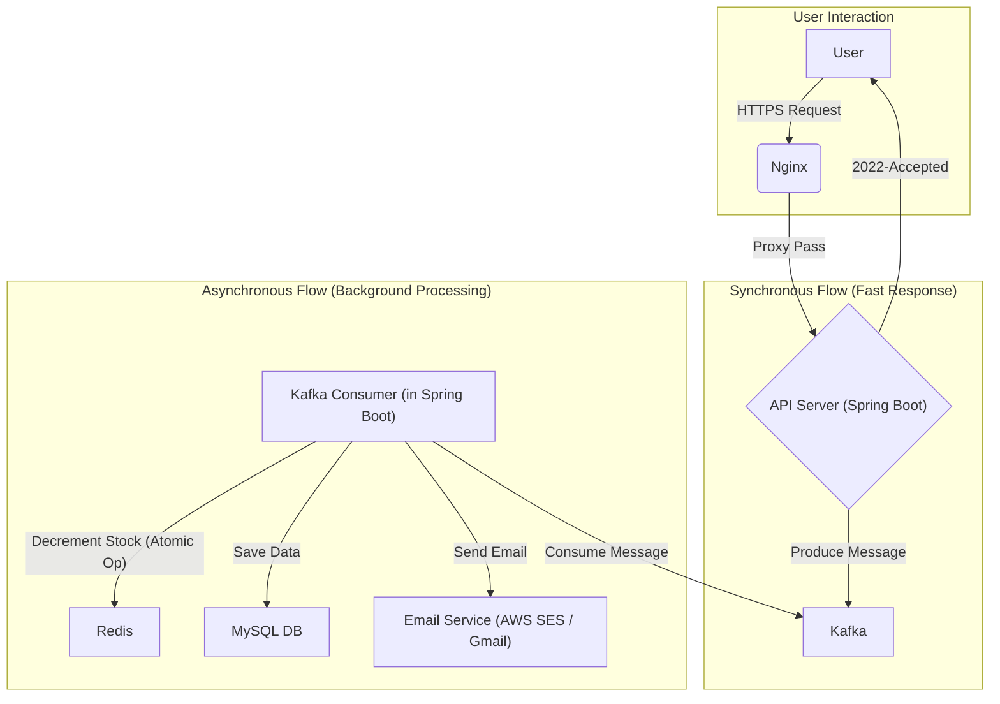

# 터닝의 마지막 선물 (Terning's Final Gift)

## 프로젝트 소개

"터닝의 마지막 선물 (Terning's Final Gift)"은 서비스 종료를 앞둔 '터닝'이 사용자들의 성원에 보답하기 위해 기획한 선착순 선물 증정 이벤트 플랫폼입니다.

이 프로젝트의 핵심 목표는 이벤트 시작과 동시에 발생하는 **1,500명 이상의 동시 접속 트래픽(Thundering Herd)을 안정적으로 처리**하는 것이었습니다. 이를 위해 Redis와 Kafka를 중심으로 한 **비동기 이벤트 기반 아키텍처**를 구축하여, 대규모 부하 상황에서도 서버 다운 없이 모든 사용자에게 공정한 참여 기회를 제공하고 데이터 무결성을 보장하는 시스템을 완성했습니다.

- 서비스 웹페이지: https://terning-farewell.cloud/

---

## 아키텍처

사용자 요청은 빠른 초기 응답을 위한 동기 흐름과, 안정적인 데이터 처리를 위한 비동기 흐름으로 분리됩니다.

대규모 트래픽을 효과적으로 분산하고 안정적으로 처리하기 위해 다음과 같이 시스템을 설계했습니다.

* **대규모 동시성 제어**: 비동기 메시지 큐(**Kafka**)를 도입하여 순간적인 트래픽 폭증(Burst Traffic)을 안정적으로 **버퍼링**하고, 단일 파티션을 통해 요청을 **직렬화**하여 순차 처리를 보장합니다.
* **원자적 연산을 통한 데이터 정합성 보장**: Kafka를 통해 직렬화된 요청을 처리하므로, 무거운 **분산 락(Distributed Lock) 없이** Redis의 Atomic 연산(Lua Script 활용)만으로 Race Condition을 원천적으로 방지하고 재고를 정확하고 효율적으로 관리합니다.
* **높은 테스트 신뢰도**: `Testcontainers`를 사용하여 실제 운영 환경과 동일한 외부 의존성(MySQL, Kafka, Redis)을 격리된 테스트 환경에서 구동하여 통합 테스트의 신뢰성을 극대화했습니다.
* **실시간 모니터링**: `Spring Actuator`와 `Datadog` APM을 연동하여 애플리케이션의 상태와 성능을 실시간으로 추적합니다.
---

## 1인 개발 프로세스

이 프로젝트는 기획부터 디자인, 프론트엔드, 백엔드, 배포까지 모든 과정을 1인 개발로 진행했습니다. 제한된 리소스 안에서 핵심 목표를 달성하기 위해 다음과 같이 역할을 분담하고 진행했습니다.

* **기획 및 디자인**: 'Thundering Herd'라는 명확한 기술적 과제를 설정하고, 이를 검증하기 위한 최소한의 기능(이메일 인증, 신청, 결과 확인)으로 사용자 시나리오를 설계했습니다.
* **프론트엔드**: 사용자가 이벤트에 원활하게 참여할 수 있는 인터페이스를 구현하는 데 집중했습니다. AI 툴을 활용하여 개발 시간을 단축하고, 핵심 역량인 백엔드 개발에 리소스를 집중했습니다.
* **백엔드 및 인프라**: 프로젝트의 핵심인 대규모 트래픽 처리 아키텍처를 설계하고 구현했습니다. Redis, Kafka를 활용한 비동기 처리 시스템을 구축하고, Docker를 통해 전체 인프라를 코드화하여 AWS에 배포 및 운영했습니다. `k6`와 `Datadog`을 이용한 데이터 기반의 성능 튜닝을 통해 시스템의 안정성을 확보하는 데 가장 많은 시간을 투자했습니다.

---

## 주요 기능 흐름

1.  **사전 이메일 인증**: 이벤트 참여 전, 이메일로 발송된 인증 코드를 통해 본인 인증을 완료합니다. (스팸 및 악의적 요청 방지)
2.  **빠른 신청 접수**: 사용자가 '선물 신청'을 하면, API 서버는 Redis에서 선착순 재고만 빠르게 확인 후 Kafka에 신청 정보를 전달하고 즉시 "접수 완료" 응답을 보냅니다.
3.  **안정적인 후속 처리**: Kafka에 쌓인 요청을 Consumer가 순서대로 가져와 DB에 저장하고, 최종 결과 안내 메일을 비동기적으로 발송합니다.
4.  **상태 조회**: 사용자는 자신의 신청 처리 상태(성공, 실패 등)를 확인할 수 있습니다.
5.  **재고 관리**: 관리자는 별도의 API를 통해 이벤트 시작 전, 선착순 재고를 설정할 수 있습니다.

---

## Tech Stack

* **Language**: Java
* **Framework**: Spring Boot, Spring Data JPA
* **Database**: MySQL(AWS RDS), Redis
* **Infra & DevOps**: AWS (EC2, SES), Kafka, Docker, Nginx
* **Monitoring & Test**: Datadog, k6

---

## API 명세

#### **1. 이메일 인증 코드 발송**

사용자의 이메일 주소로 6자리 인증 코드를 발송합니다.
`POST /api/auth/send-verification-code`

#### **2. 이메일 인증 코드 확인**

사용자가 입력한 인증 코드가 유효한지 검증합니다.
`POST /api/auth/verify-code`

#### **3. 선물 신청**

인증된 사용자가 선착순 이벤트에 참여를 신청합니다.
`POST /api/event/apply`

#### **4. 신청 상태 조회**

사용자 본인의 이벤트 신청 결과를 조회합니다.
`GET /api/event/status`

#### **5. (관리자) 이벤트 재고 설정**

관리자가 이벤트 시작 전, 총 선물 재고 수량을 설정합니다.
`POST /api/admin/event/stock`
